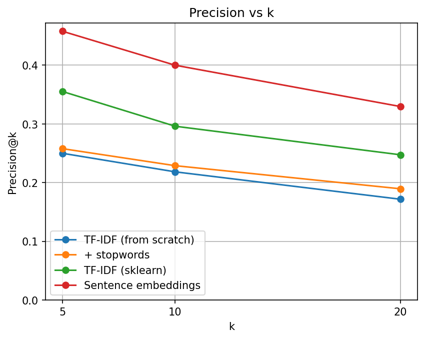
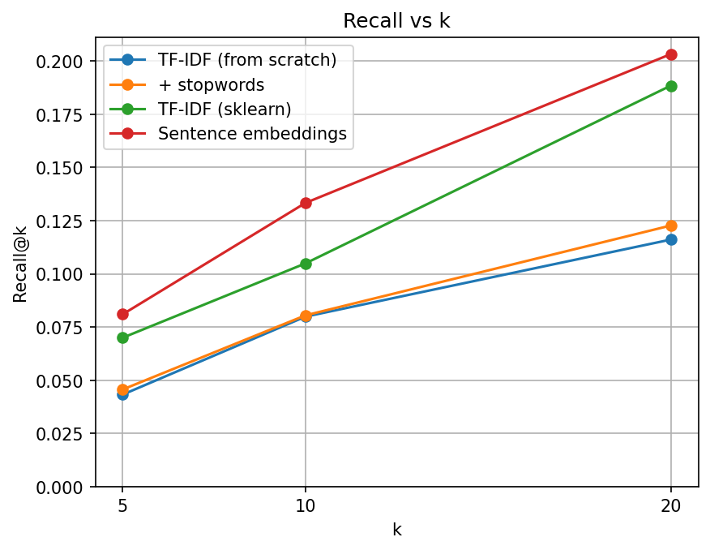
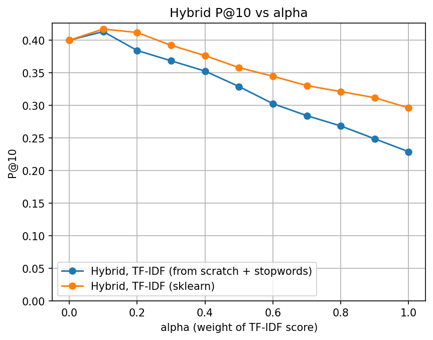
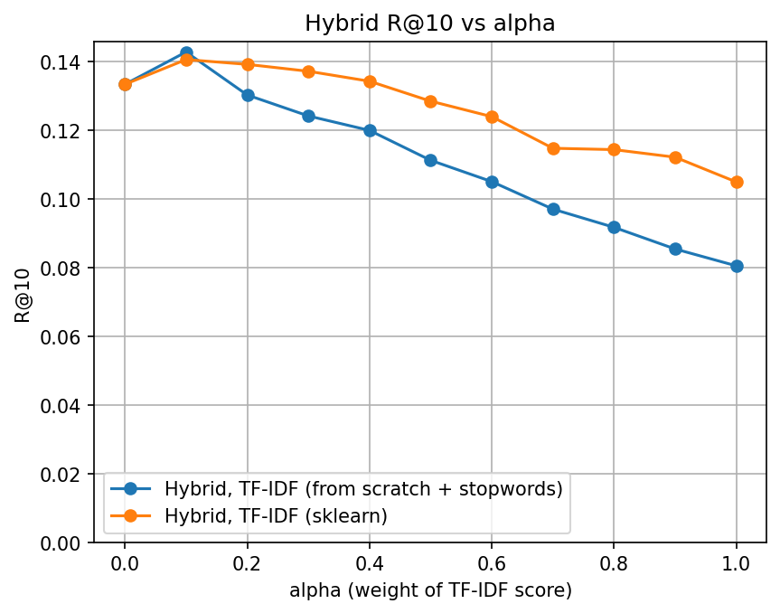

# TF-IDF-Search-Engine

A document search engine over the CISI collection, built to compare lexical and semantic retrieval:
a from-scratch TF-IDF, the same TF-IDF with stopword removal, scikit-learn's TF-IDF, sentence embeddings,
and a hybrid that blends TF-IDF with embeddings.

## Setup

```
pip install -r requirements.txt
```

The sentence-transformer model (all-MiniLM-L6-v2) is downloaded on first use, and document embeddings are cached in `cache/`.

**Data.** `CISI.txt`, `CISI.QRY` and `CISI.REL` are the CISI collection (1,460 documents, 112 queries) from the
[University of Glasgow IR test collections](https://ir.dcs.gla.ac.uk/resources/test_collections). Check the
collection's terms before redistributing it if you make this repository public.

## Evaluation setup

- **Dataset:** CISI. 76 of the 112 queries have relevance judgments; the other 36 are skipped.
- **Metrics:** precision@k and recall@k for k = 5, 10, 20, macro-averaged over the 76 queries.
- **Headline metric:** P@10, used throughout, including the hybrid section.

## Results

| Method | P@5 | P@10 | P@20 | R@10 | R@20 |
|---|---|---|---|---|---|
| TF-IDF (from scratch) | 0.2500 | 0.2184 | 0.1717 | 0.0799 | 0.1161 |
| + stopwords | 0.2579 | 0.2289 | 0.1895 | 0.0805 | 0.1227 |
| TF-IDF (sklearn) | 0.3553 | 0.2961 | 0.2474 | 0.1049 | 0.1884 |
| Sentence embeddings (all-MiniLM-L6-v2) | 0.4579 | 0.4000 | 0.3296 | 0.1333 | 0.2032 |

Stopword removal gives TF-IDF a small gain, and scikit-learn's TF-IDF is a clear step up from the
from-scratch version (P@10 0.229 to 0.296). Sentence embeddings are the strongest single method,
reaching P@10 0.400 against 0.218 for the baseline.




## Hybrid

The hybrid min-max normalizes the TF-IDF and embedding scores and blends them:
`alpha * TF-IDF + (1 - alpha) * embeddings`. So alpha 0 is embeddings only and alpha 1 is TF-IDF only.
The from-scratch TF-IDF used in the hybrid includes stopword removal.




P@10 peaks at alpha 0.1 (sklearn 0.417, from-scratch 0.413, against 0.400 for embeddings alone) and then
falls steadily as the TF-IDF weight rises, to 0.296 and 0.229 at alpha 1. R@10 peaks at the same point
(sklearn 0.141, from-scratch 0.143, against 0.133). This is a small effect: TF-IDF adds little on top of the
embeddings here, and at most alpha values the hybrid is worse than embeddings alone.
alpha was chosen on the same 76 queries, so these gains may not generalize.

## Reproduce

```
python main.py          # interactive search prompt; the method is set by METHOD at the top of the file
python eval.py          # evaluate one method; the method is set at the bottom of the file
python run_all.py       # every run, writes results/all_runs.csv
python make_figures.py  # the charts above, from the CSV
```

Full numbers for every run: [results/all_runs.csv](results/all_runs.csv).

## Limitations and next steps

- Only one embedding model (all-MiniLM-L6-v2) was tried; larger or retrieval-tuned models may do better.
- No stemming or BM25 baseline, so the lexical side is weaker than it could be.
- alpha was tuned and evaluated on the same 76 queries, and the query set is small; a held-out split would give a fairer estimate.
